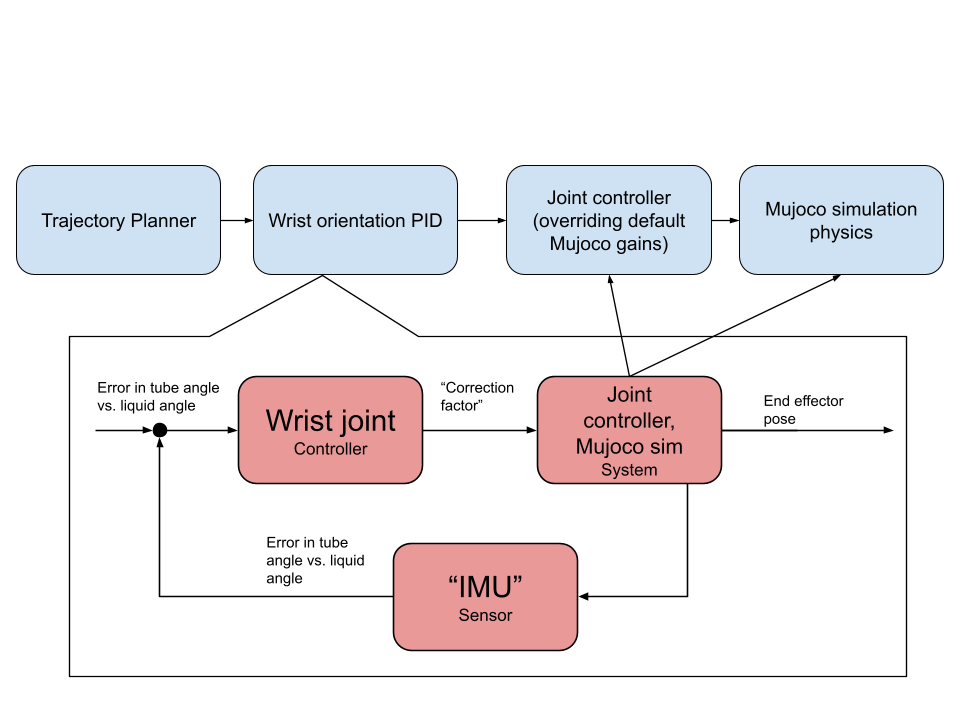
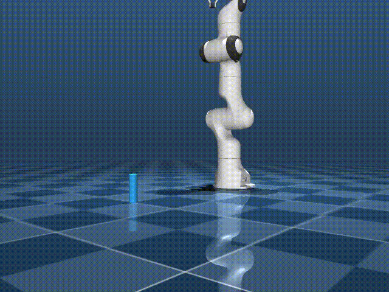

*Alan Ramirez, Zoey You, Sarah Huang, Sophia Zhao*

# 16299 Final Project: Centrifuge Tube Transporter

## Abstract

Automated handling of biological samples is increasingly common in modern chemistry and biology laboratories, but standard robotic motion planners are largely agnostic to the fluid dynamics inside the containers they transport. For samples such as density-gradient centrifuge tubes, the jerk, acceleration, and orientation profile of the end effector during transport directly determines whether carefully separated liquid layers remain intact or re-mix. In this project, we implement a feedback control pipeline on a simulated Franka Panda 7-DOF arm in MuJoCo that transports a centrifuge tube while keeping its long axis aligned with the effective acceleration vector experienced by the liquid, so that the tube tilts with the trajectory rather than against it. The pipeline combines minimum-jerk 5th-order-polynomial trajectory planning, damped least-squares inverse (differential) kinematics, and a wrist-orientation PID controller injected through the null space of the IK problem. We define a mix angle, the error between the tube's z-axis and a lagged effective acceleration vector, as both the evaluation metric and the PID error signal. Across repeated trials, enabling the wrist PID reduced the mean average mix angle from 34.4 deg to 14.2 deg and the time-integrated mix from 96.4 deg-s to 39.7 deg-s, with comparable end-effector tracking error. These results are also compared against a no-PID inverse kinematics solution considering both end effector position and orientation, still showing improvement compared to inverse differential kinematics alone. These results show that a feedback layer exploiting kinematic redundancy is potentially useful to substantially reduce liquid disturbance during transport without modifying the underlying trajectory planner.

## Motivation

Robotic automation is expanding into chemistry and biology laboratories, where manipulators are increasingly used for tasks that were previously performed by hand: pipetting, plate handling, sample transfer, and tube transport between instruments such as centrifuges, incubators, and analyzers. Commercial systems are being developed for these purposes constantly. The promise of this automation is throughput and reproducibility, but it rests on an assumption that the robot can move sample containers without disturbing what is inside them.
However, this can be problematic. A centrifuge tube containing two separated liquid layers is highly sensitive to the dynamics of how it is moved. Sharp accelerations, abrupt direction changes, and orientation errors during transport induce sloshing that can re-mix layers and destroy the work the centrifuge has just done. Standard motion planners optimize for kinematic objectives such as path length, smoothness in joint space, or end-effector tracking error, do not necessarily have consideration of fluid mechanics within the end-effector object, of the direction of the effective acceleration vector inside the tube, or of how tube orientation should evolve in response to that vector.
The goal of this project is to explore how feedback control can help develop these systems with those constraints in mind. We implement a feedback controller that runs on top of a conventional trajectory planner and continuously corrects the tube orientation so that the tube's long axis remains aligned with the direction of the effective acceleration the liquid experiences. Intuitively, the controller tries to make the tube behave from the liquid's perspective like a tube that is simply standing in gravity, even while the arm is moving along a trajectory. We evaluate this idea in simulation on a Franka Panda 7-DOF arm in MuJoCo, comparing transport with and without the PID layer.

## Methods : Kinematics

### Control Architecture and Trajectory
The kinematics approach utilizes a dual-loop PID control architecture to track a predefined sequence of spatial waypoints (Hover, Descend, Grasp, Lift, Transport, Place, Release). 

* **Trajectory Generation**: Inverse differential kinematics are used. To prevent sudden acceleration spikes that would disturb the payload, transitions between waypoints are governed by a 5th-order minimum-jerk polynomial. For a normalized time $\tau = t/\text{duration}$, the position scaling $s$ is calculated as:
    $$s(\tau) = 10\tau^3 - 15\tau^4 + 6\tau^5$$
    The overall execution speed of these phases is parameterized by a tunable `time_scale`.
* **Task-Space and Joint-Space Control**: A Task-Space PID controller minimizes the Cartesian error between the minimum-jerk trajectory and the end-effector's actual position. This 3D correction is mapped into the 7-DOF joint space using a damped pseudo-inverse Jacobian. This is combined with a null-space projection to keep the robot near a safe home posture ($Q_{\text{HOME}}$) without disrupting the end-effector task. Finally, a Joint-Space PD controller computes the necessary motor torques.

### Active Slosh Compensation
To minimize liquid mixing, the system mathematically models the internal liquid surface by tracking the **effective gravity vector**. This vector accounts for both standard gravity and the low-pass filtered acceleration of the end-effector, simulating the delayed sloshing motion of a viscous fluid.

If active wrist compensation (`use_wrist_pid`) is enabled, the controller computes the cross product between the actual tube's Z-axis and the effective gravity vector. This rotational error is mapped directly to the wrist joints via the Jacobian transpose, allowing the robot to actively tilt the tube into curves to counteract lateral acceleration and keep the liquid surface flat relative to the tube opening.

## Files

- **`test_picking.py`**: Interactive simulator with real-time viewer. Runs one trial with configurable LIQUID_TAU and wrist PID gains.
- **`record_test_picking.py`**: Offline video recorder. Generates MP4 of trajectory with custom camera angles for visualization.
- **`trial_runs.py`**: Batch sweep over LIQUID_TAU (0.0→2.0s). Runs multiple trials and saves stats to CSV.


## Methods : Partial PID

### Mixing Metric

We found great troubles in trying to simulate liquids in our environment. It is instead dealt with by defining a proxy metric:

- `tube_axis`: which way the tube is pointing (gripper Z-axis)
- `a_effective`: gravity + end-effector acceleration (what the liquid feels)
- `a_liquid`: `a_effective` with a 1-second lag, modeling liquid inertia
- `mix_angle`: angle between `tube_axis` and `a_liquid`

```
mix_angle = arccos(dot(tube_axis, a_liquid / |a_liquid|))   [degrees]
```

0° = tube perfectly aligned with liquid settlement = no mixing risk. The integrated mixing score `∫ mix_angle dt` (°·s) is the primary benchmark.

---

### System Architecture


**Three layers:**

1. **Trajectory Planner**: 5th-order minimum-jerk polynomial per phase. Zero velocity and acceleration at endpoints minimizes jerk. Phases: Hover → Descend → Grasp → Lift → Transport → Place → Release.

2. **Wrist Orientation PID**: closed-loop controller on `mix_angle`. Correction projected into Jacobian null-space to rotate the wrist toward alignment without disturbing end-effector position.

3. **Joint PID**: custom torque controller overriding MuJoCo's default gains: `τ = Kp*(q_des - q) - Kd*q̇`

---

### Key Implementation Details

**Minimum-jerk trajectory** (Flash & Hogan 1985, Macfarlane & Croft 2003):
```
x(t) = a₀ + a₁t + a₂t² + a₃t³ + a₄t⁴ + a₅t⁵
a₃ = 10(xf-x₀)/T³,  a₄ = -15(xf-x₀)/T⁴,  a₅ = 6(xf-x₀)/T⁵
```

**Damped least-squares IK** (Buss 2009) converts Cartesian targets to joint angles without singularity blowup:
```
dq = Jᵀ(JJᵀ + λ²I)⁻¹ dx
```

**Null-space injection** (Liégeois 1977) lets wrist orientation control run without fighting the position task.


## Files

- **`test_picking.py`**: Interactive simulator with real-time viewer. Runs one trial with configurable LIQUID_TAU and wrist PID gains.
- **`record_test_picking.py`**: Offline video recorder. Generates MP4 of trajectory with custom camera angles for visualization.
- **`trial_runs.py`**: Batch sweep over LIQUID_TAU (0.0→2.0s). Runs multiple trials and saves stats to CSV.

---

## Results

<div style="display: flex; gap: 20px; justify-content: center; flex-wrap: wrap;">
  <div>
    <h3>No PID Control</h3>
    <p><i>[Insert kinematics_no_pid.gif]</i></p>
  </div>
  <div>
    <h3>Joint PD Only</h3>
    <p><i>[Insert kinematics_joint_pd_only.gif]</i></p>
  </div>
  <div>
    <h3>Full Body Only (No Wrist)</h3>
    <p><i>[Insert kinematics_full_body_only.gif]</i></p>
  </div>
  <div>
    <h3>Full Body + Wrist Compensation</h3>
    <p><i>[Insert kinematics_full_body.gif]</i></p>
  </div>
</div>


<div style="display: flex; gap: 20px; justify-content: center;">
  <div>
    <h3>Without PID</h3>
    
  </div>
  <div>
    <h3>With Wrist Orientation PID</h3>
    
  </div>
</div>

---

Linearly interpolated lag (`LIQUID_TAU`) from 0.0 to 2.0 seconds across 50 trials each with and without wrist orientation PID control.

| Metric | No Wrist PID | With Wrist PID |
|---|---|---|
| Mean avg EE speed (m/s) | 0.3726 | 0.4076 |
| Mean max EE speed (m/s) | 1.2977 | 1.4255 |
| Mean avg pos error (m) | 0.0781 | 0.0843 |
| Mean max pos error (m) | 0.3246 | 0.3338 |
| **Mean avg mix angle (°)** | **34.41** | **14.09** |
| **Mean max mix angle (°)** | **43.80** | **41.51** |
| **Mean integrated mix (°·s)** | **96.42** | **39.49** |

---

## Replication

### Requirements
```bash
pip install mujoco numpy
mjpython main.py   # mjpython required on macOS Apple Silicon
```

Place your Franka Panda XML at `franka_emika_panda/scene.xml`. The script auto-generates a combined scene with the centrifuge tube injected.

### Key Parameters

| Parameter | Default | Effect |
|---|---|---|
| `LIQUID_TAU` | 1.0s | Liquid reorientation lag |
| `ACCEL_LPFILTER_ALPHA` | 0.03 | Acceleration smoothing |
| `USE_WRIST_PID` | True | Enable closed-loop mixing control |
| `wrist_pid kp` | 0.5 | Correction aggressiveness |
| `wrist_pid kd` | 0.1 | Wrist damping: increase if oscillating |

### Tuning the PID
Start with `ki=0, kd=0`. Increase `kp` until the arm visibly corrects wrist orientation during transport. Add `kd` if the wrist oscillates. 

---

## Reflections

### Changes Since Initial Presentation

Considerations arose during initial presentations of this project to the class, where suggestions were made to not reduce the arm's DOF from 7 to 6. We chose to, instead of replacing the wrist entirely, blend existing inverse differential kinematics with information (injected into the null space) from the other PID loop. We additionally added a comparison to a full 6-element vector (position and orientation instead of just position) goal to compare against pure inverse kinematics with no separate PID in response to these suggestions.

### What Worked

The idea of adding a separate PID feedback loop to inject some information about desired wrist position proved to improve mixing score by quite a lot. This was the crux of our project, and it performed better (even if marginally) than using full inverse kinematics with orientation and position. 

Additionally, getting the Mujoco simulation to have the robot follow trajectories worked well.

### What Didn't Work

Lots of effort went into deciding 1) where to use feedback control in the project and 2) how to define liquid mixing. 

For the first point, choosing to apply a separate PID loop for the wrist angle was decided after realizing using PID to "minimize jerk" was hard to accomplish. We found that trying to adjust all the joints' PID controllers to "minimize jerk" made it really difficult to have stable movement. Thus, we relied on the trajectory planning following the Macfarlane & Croft paper to minimize jerk overall, and decided to make the PID more granular. 

For the second point, this is still an ongoing question. We decided to go with our metric because it was simpler to implement and allowed for a clear error signal for PID to correct. Having the liquid "lag" also introduced real-world inconsistencies as well. However, this representation is something that can be continually worked on and improved, as it is not necessarily the best representation of fluid physics.

Lastly, issues arose with using Mujoco itself for picking up objects. We look to translate simulation to real Franka arms in the future. Future work is discussed below.

---
## Conclusion

We find that using PID to control tuble angle can be a potentially useful addition to laboratory robots. Adding a PID layer for the wrist joint specifically that is injected into the null space of regular pose can yield less liquid mixing (according to metrics defined by angle of the tube and liquid) while simultaneously not affecting the PID of the joints themselves for trajectory following. These results imply that considering centrifuge tube transport could be a well-scoped task for robot manipulators even though these payloads can be sensitive. 

---

## References

- Flash & Hogan (1985). The coordination of arm movements. *Journal of Neuroscience*, 5(7).
- Macfarlane & Croft (2003). Jerk-bounded manipulator trajectory planning. *IEEE T-RA*, 19(1).
- Buss (2009). Introduction to inverse kinematics with Jacobian transpose, pseudoinverse and damped least squares methods.
- Liégeois (1977). Automatic supervisory control of multibody mechanisms. *IEEE T-SMC*, 7(12).
